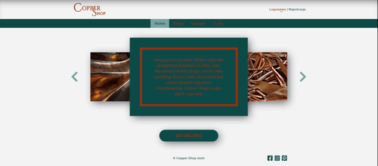
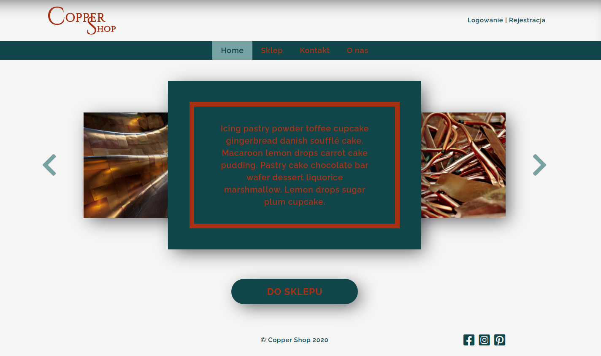
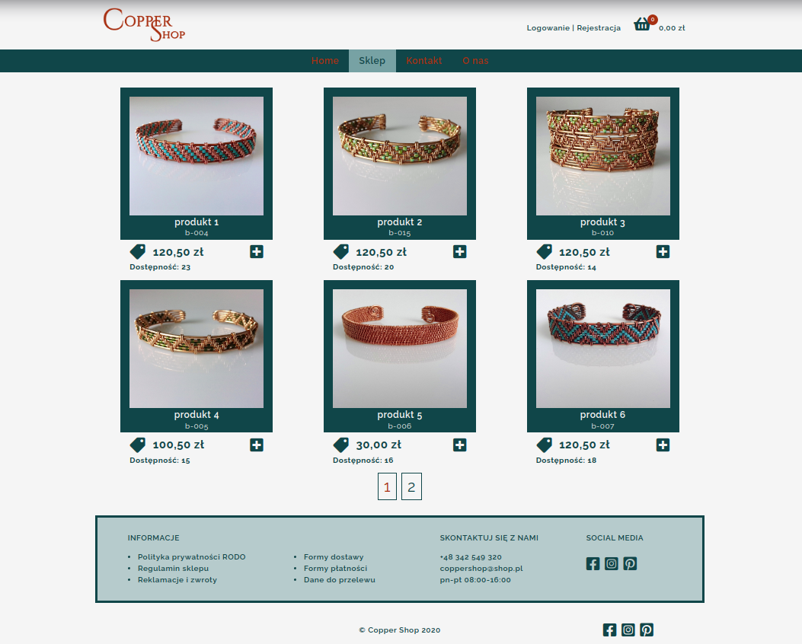
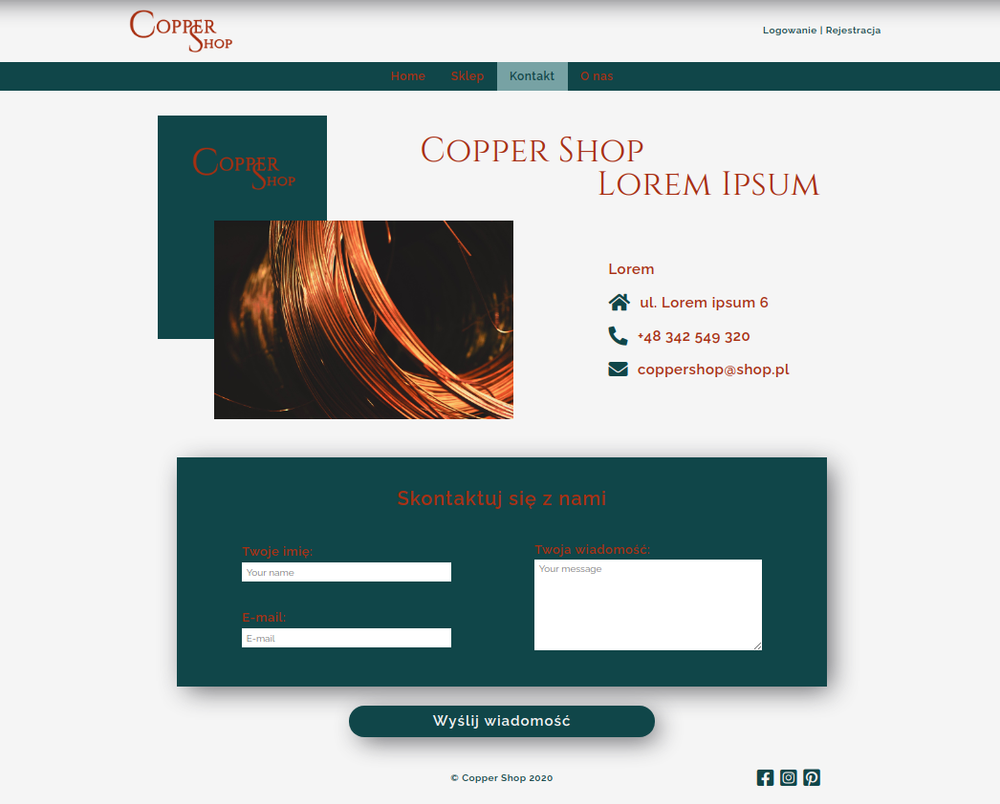
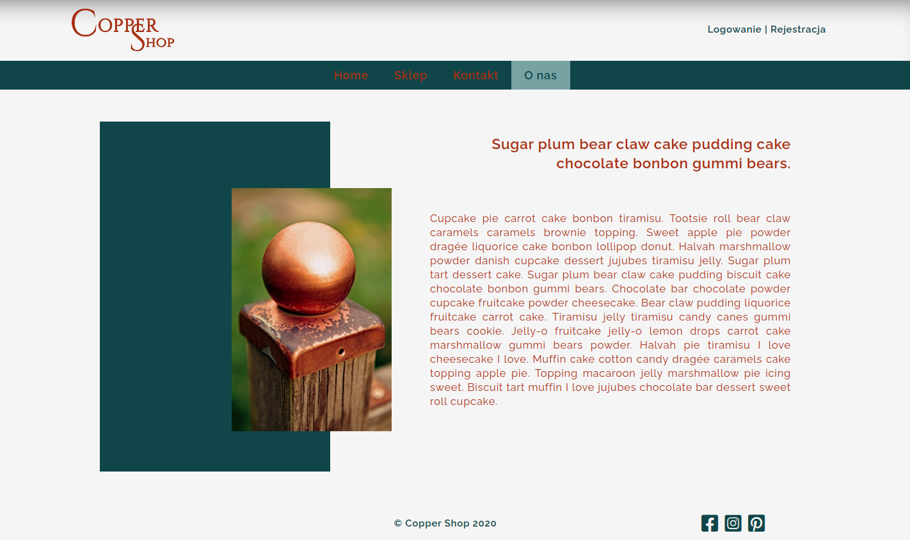
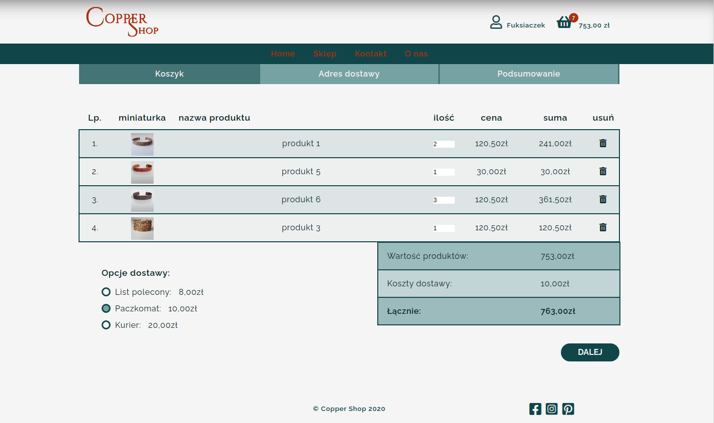
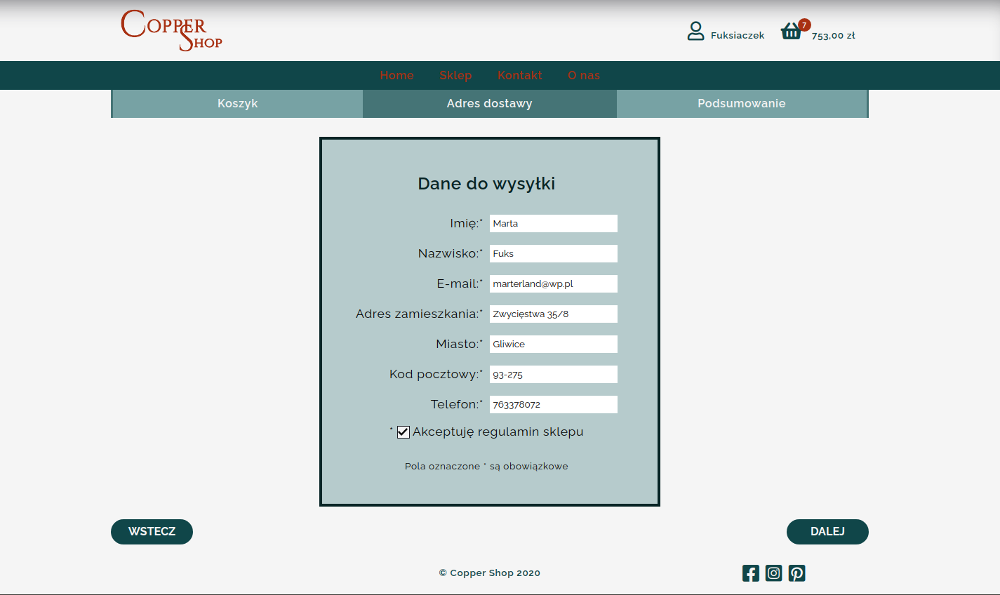
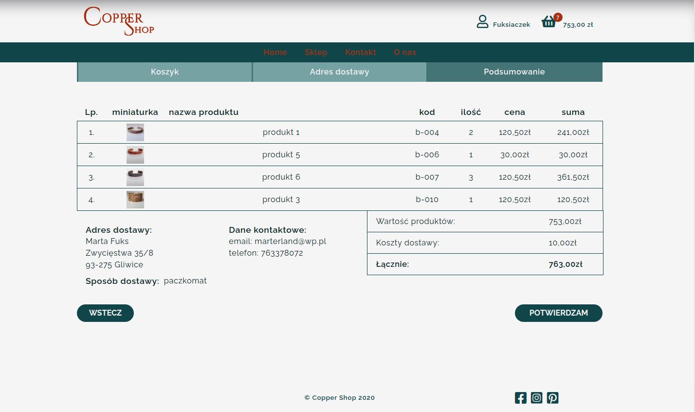
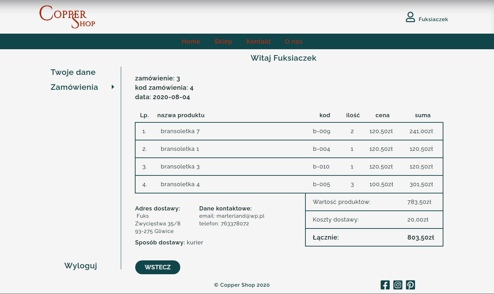

# Copper shop template

Copper shop template is an example web template for online shops. 
Website general mockup was made in Wix website creator but without using any premade template. 
The main website itself was created here from the beginning.

## Shop mockup:

go see [mockup](https://fuksmarta.wixsite.com/website-1/sklep)

## Technologies:

- npm
- Node.js
- Create React App
- HTML5
- Sass
- JavaScript
- React, JSX
- JSON Server / MySQL
- Express.js

## Installation:

- #### clone the repository
  `git clone https://github.com/mfuks/copper_shop_template.git`
- #### install all dependencies
  `npm install`
- #### connect to database

   on http://localhost:3306

- #### start database
   in "backend" folder:
   
   `node Backend.js`

- #### preview
   in "frontend" folder:
  `npm start` and go to [http://localhost:3000/](http://localhost:3000/)

## Desktop Demo 

- #### general view

- #### shopping

- #### user panel

## Screen view:

- #### Home page / Home

- #### Shop / Sklep

- #### Contact / Kontakt

- #### About us / O nas

- #### Basket step 1 / Koszyk krok 1

- #### Basket step 2 / Koszyk krok 2

- #### Basket step 3 / Koszyk krok 32

- #### User panel - order details / Panel użytkownika - podgląd zamówienia
